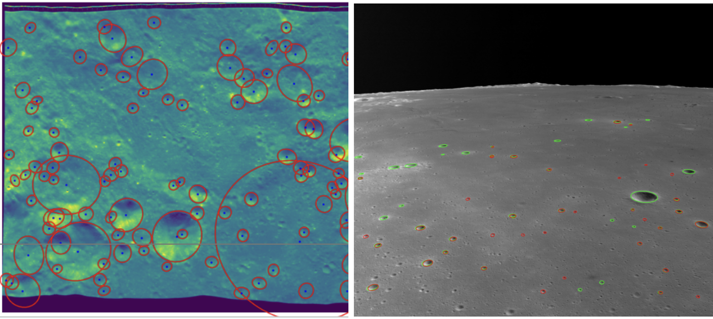
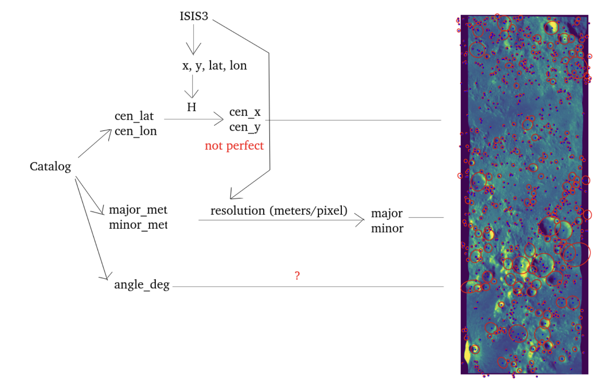
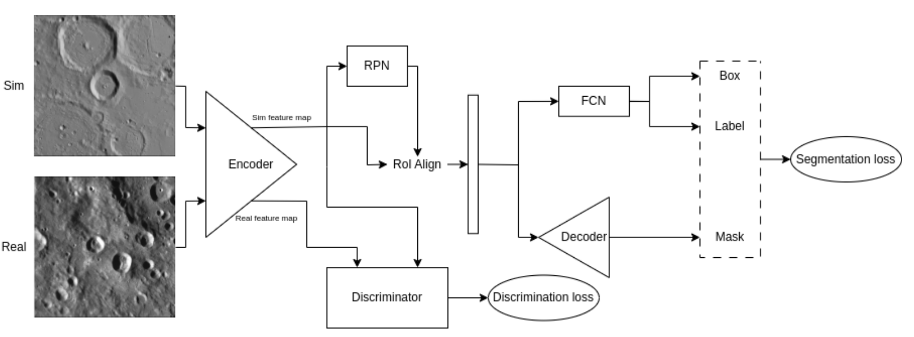
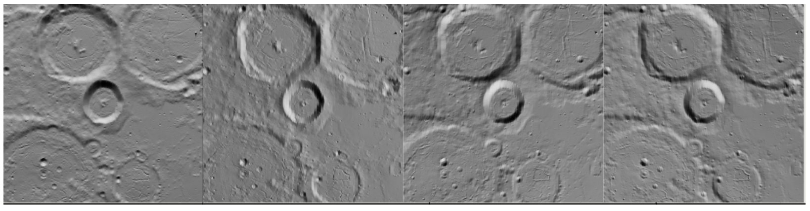
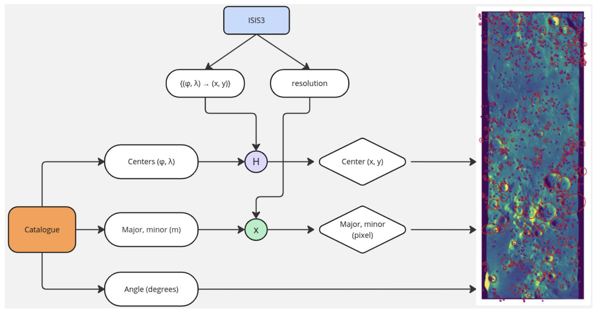
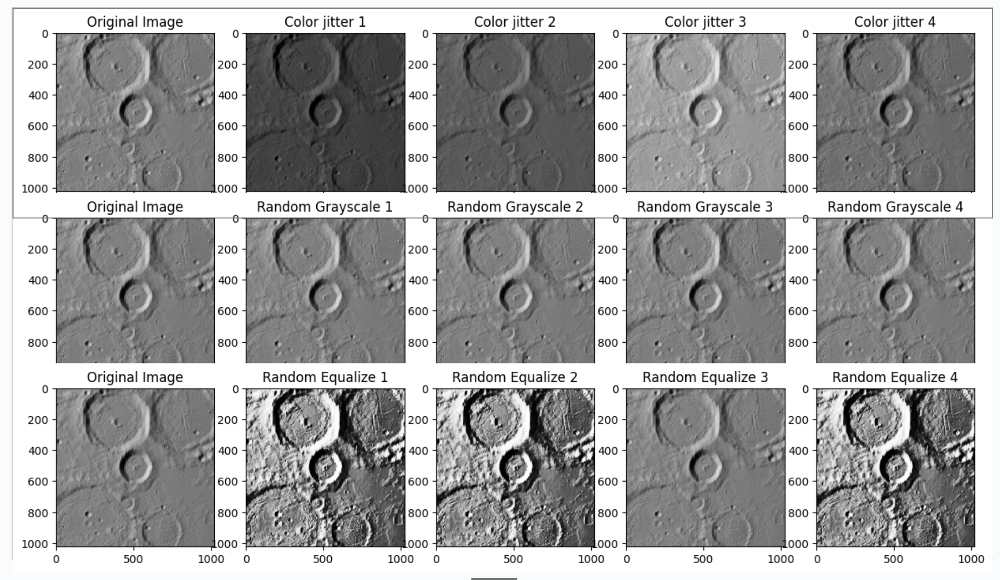
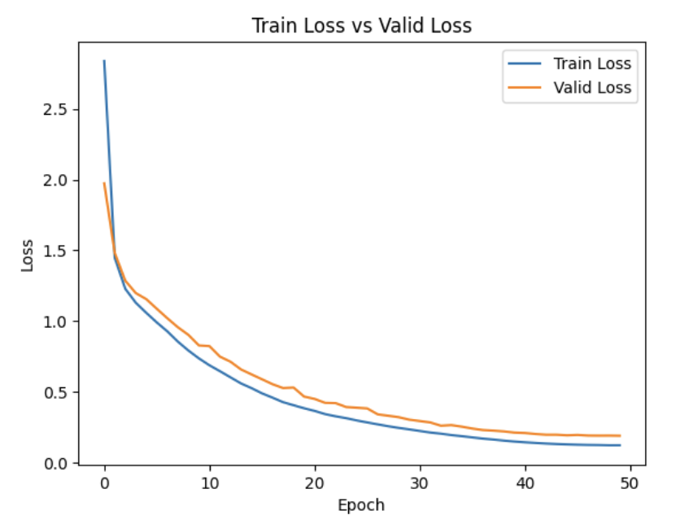

# Lunar Crater Detection using Deep Neural Networks and Domain Adaptation

[](https://www.python.org/downloads/)
[](https://pytorch.org/)
[](LICENSE)

> A deep learning framework for detecting lunar craters using Mask R-CNN with adversarial domain adaptation (MaskRCDA) to bridge the gap between synthetic and real lunar imagery.


_Example detection results on LRO WAC (left) and Chang'e 5 (right) datasets. Green ellipses show ground truth, red ellipses show predictions._

## 📋 Table of Contents

- [Overview](#overview)
- [Features](#features)
- [Architecture](#architecture)
- [Dataset](#dataset)
- [Installation](#installation)
- [Usage](#usage)
- [Results](#results)
- [Project Structure](#project-structure)
- [Citation](#citation)
- [License](#license)

## 🌙 Overview

This project addresses the challenge of autonomous lunar landing through advanced crater detection algorithms. Training deep learning models for lunar crater detection faces a significant hurdle: the scarcity of labeled real-world data. Our solution leverages **domain adaptation** to train models on abundant synthetic data and adapt them to real lunar imagery.

### Key Highlights

- **MaskRCDA Architecture**: Extends Mask R-CNN with adversarial domain adaptation
- **Multi-Domain Support**: Trained on synthetic CRESENT dataset, tested on LRO WAC and Chang'e 5
- **Comprehensive Pipeline**: Complete framework for processing LRO WAC data
- **Instance Segmentation**: Pixel-level crater detection with ellipse fitting


_Complete detection pipeline from data curation to domain adaptation_

## ✨ Features

- 🎯 **Instance Segmentation**: Precise pixel-level crater boundary detection
- 🔄 **Domain Adaptation**: Adversarial training to bridge synthetic-to-real gap
- 📊 **Multiple Datasets**: Support for CRESENT (synthetic), LRO WAC, and Chang'e 5
- 🎨 **Advanced Augmentation**: Six-strategy augmentation pipeline (crop, color jitter, equalize, posterize, flip, rotate)
- 🚀 **High Performance**: F1 score of 0.86 on synthetic domain
- 📈 **LRO WAC Pipeline**: Automated processing framework for Wide Angle Camera images

## 🏗️ Architecture

### MaskRCDA (Mask R-CNN with Domain Adaptation)

Our architecture combines the precision of Mask R-CNN with the adaptability of adversarial domain adaptation:

```
Input Images (Synthetic + Real)
         ↓
    Backbone (ResNet50-FPN)
         ↓
    Feature Maps
    ↙         ↘
Segmentation   Discriminator
  Branch         (Domain)
    ↓              ↓
 Masks    Domain Classification
```


_MaskRCDA architecture showing dual-input processing with adversarial domain adaptation_

**Key Components:**

1. **Backbone Network**: ResNet50 with Feature Pyramid Network (FPN)
2. **Region Proposal Network (RPN)**: Generates crater candidates
3. **ROI Align**: Preserves spatial alignment for accurate segmentation
4. **Segmentation Head**: Predicts pixel-level crater masks
5. **Domain Discriminator**: Adversarial component for domain-invariant features

### Training Configuration

```python
Optimizer: AdamW with weight decay
Learning Rate: 5×10⁻⁴ with OneCycleLR scheduler
Batch Size: 32 (8 for domain adaptation)
Epochs: 50
Input Size: 256×256 pixels
Backbone: ResNet50-FPN (pretrained on COCO)
```

## 📚 Dataset

### 1. CRESENT (Synthetic)

- **Source**: PANGU (Planet and Asteroid Natural scene Generation Utility)
- **Size**: 2,562 grayscale images (1024×1024 pixels)
- **Annotations**: Ellipse parameters from Robbins' catalogue (1.3M craters)
- **Variety**: 3-150+ craters per image, emission angles 0-60°


_CRESENT synthetic dataset with varying lighting conditions and crater densities_

### 2. LRO WAC (Real)

- **Source**: Lunar Reconnaissance Orbiter Wide Angle Camera
- **Processing**: Custom ISIS3 pipeline with radiometric correction
- **Size**: 706 processed images (1024×1024 pixels)
- **Coverage**: 104km wide field of view
- **Filters**: Latitude ±30°, incident angle 0-70°


_LRO WAC data processing pipeline from raw images to labeled dataset_

### 3. Chang'e 5 (Real)

- **Source**: Chang'e 5 Landing Camera
- **Size**: 414 manually annotated images
- **Annotations**: ~50 ellipse-labeled craters per image
- **Characteristics**: Varying perspective from descent sequence

## 🚀 Installation

### Prerequisites

- Python 3.12 or higher
- CUDA-capable GPU (recommended)
- 16GB+ RAM

### Setup

1. **Clone the repository**

```bash
git clone https://github.com/jamesphm04/maskrcnn_from_scratch/tree/main
cd maskrcnn_from_scratch
```

2. **Create virtual environment**

```bash
python -m venv venv
source venv/bin/activate  # On Windows: venv\Scripts\activate
```

3. **Install dependencies**

```bash
pip install torch torchvision --index-url https://download.pytorch.org/whl/cu118
pip install -r requirements.txt
```

### Dependencies

```
torch>=2.0.0
torchvision>=0.15.0
numpy>=1.24.0
opencv-python>=4.7.0
Pillow>=9.5.0
tqdm>=4.65.0
distinctipy>=1.2.2
cjm-pytorch-utils>=0.1.0
cjm-torchvision-tfms>=0.1.0
```

## 💻 Usage

### Training

#### 1. Basic Training on Synthetic Data

```bash
python train.py \
    --data_dir data/converted_images_wac_gan/ \
    --annotations data/sofia_data_v2/ground_truth_projected_ellipses \
    --epochs 50 \
    --batch_size 32 \
    --lr 1e-4 \
    --device cuda:0
```

#### 2. Training with Domain Adaptation

```bash
python DA_v2_integrate_gan.ipynb  # For GAN-based adaptation
# or
python DA_v2_integrate_fda.ipynb  # For FDA-based adaptation
```

### Data Preparation

#### Processing LRO WAC Images

```bash
# 1. Download LRO WAC images from ASU LROC archive
# 2. Process with ISIS3
bash process_lro_wac.sh

# 3. Project Robbins catalog annotations
python notebooks/crater_projection.py --input_dir raw_images/ --output_dir processed/
```

## 📊 Results

### Performance Metrics

| Configuration           | Dataset     | Precision | Recall   | F1 Score |
| ----------------------- | ----------- | --------- | -------- | -------- |
| No Augmentation         | CRESENT     | 0.71      | 0.60     | 0.65     |
| Mosaic + Color + Rotate | CRESENT     | 0.82      | 0.72     | 0.77     |
| **Full Augmentation**   | **CRESENT** | **0.88**  | **0.84** | **0.86** |
| Sim2Chang (no DA)       | Chang'e 5   | 0.00      | 0.00     | 0.00     |
| Sim2Chang (with DA)     | Chang'e 5   | 0.10      | 0.10     | 0.10     |
| Sim2WAC (no DA)         | LRO WAC     | 0.00      | 0.00     | 0.00     |
| Sim2WAC (with DA)       | LRO WAC     | 0.10      | 0.10     | 0.10     |

### Key Findings

✅ **Augmentation Impact**: Full augmentation strategy improved F1 from 0.65 to 0.86 (+32%)

✅ **Domain Adaptation**: MaskRCDA improved cross-domain performance from 0.00 to 0.10

⚠️ **Domain Gap**: Significant performance drop reveals substantial challenges in synthetic-to-real transfer

### Visual Results


_Effect of different augmentation strategies on detection quality_


_Comparison of model predictions with and without domain adaptation_

## 🔬 Methodology Details

### Data Curation

1. **CRESENT Synthetic Data**
   - Generated via PANGU software with actual lunar DEMs
   - Annotations from Robbins' catalogue (1.3M craters)
   - Emission angles: 0-60° for viewpoint diversity

2. **LRO WAC Processing Pipeline**

   ```
   Raw Images → ISIS3 Processing → Radiometric Correction
   → Map Projection → Robbins Catalog Projection
   → Sliding Window Cropping → 1024×1024 Tiles
   ```

3. **Chang'e 5 Dataset**
   - Manual ellipse annotations on descent imagery
   - Varying crater counts based on altitude

### Evaluation Metrics

- **IoU Threshold**: 0.5 (bounding box approximation of ellipses)
- **Precision**: TP / (TP + FP)
- **Recall**: TP / (TP + FN)
- **F1 Score**: 2 × (Precision × Recall) / (Precision + Recall)

**Note**: We use axis-aligned bounding boxes for computational efficiency rather than precise ellipse IoU.

## 🎯 Applications

This research has potential applications in:

- **Autonomous Lunar Landing**: Real-time crater detection for navigation
- **Geological Mapping**: Large-scale lunar surface characterization
- **Mission Planning**: Landing site selection and hazard assessment
- **Planetary Science**: Crater age estimation and distribution analysis

## 🚧 Current Limitations & Future Work

### Limitations

1. **Domain Gap**: Large performance drop from synthetic to real (0.86 → 0.10 F1)
2. **Crater Depth**: Current method focuses only on rim detection
3. **Loss Function**: May require task-specific optimization
4. **Small Craters**: Limited detection of sub-pixel craters

### Future Directions

- [ ] Implement CycleGAN for improved domain translation
- [ ] Incorporate crater depth and degradation features
- [ ] Explore semi-supervised domain adaptation
- [ ] Test on additional real datasets (e.g., Chandrayaan-2)
- [ ] Develop end-to-end navigation system integration
- [ ] Create extensive LRO WAC labeled dataset

## 📖 Citation

If you use this work in your research, please cite:

```bibtex
@article{pham2026lunar,
  title={Lunar Crater Detection using Deep Neural Networks and Domain Adaptation},
  author={Pham, Ky Cuong},
  journal={The University of Adelaide},
  year={2026}
}
```

## 🙏 Acknowledgments

- **CRESENT Dataset**: McLeod et al. (2024)
- **Robbins Catalog**: Comprehensive lunar crater database
- **LRO Mission**: NASA/ASU for WAC imagery
- **Chang'e 5**: CNSA for landing camera data
- **PANGU Software**: Planet surface simulation platform

## 📄 License

This project is licensed under the MIT License - see the [LICENSE](LICENSE) file for details.

## 📧 Contact

**Ky Cuong Pham**  
The University of Adelaide  
Email: a1906313@adelaide.edu.au  
GitHub: [@jamesphm04](https://github.com/jamesphm04)

---
